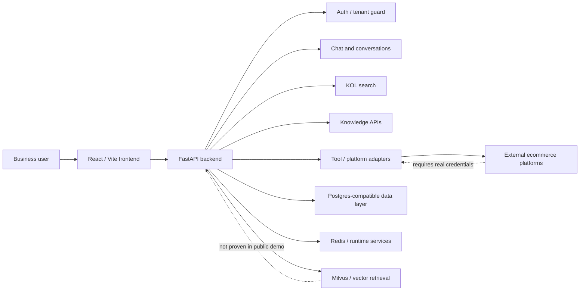

# AgentX

AgentX is an AI digital-employee demo for ecommerce teams, covering chat, KOL search, knowledge workflows, tool calls, and hardened trusted user paths.

## Public Demo Status

- Online demo: not deployed yet.
- Public smoke test: not verified yet.
- Current display branch: `codex/public-demo-20260810`.
- Local baseline tag: `public-demo-local-20260811-v10`.
- Selected first deployment path: Vercel frontend, Render backend, Neon Postgres.
- Current scope: reproducible local/public-demo baseline without local runtime data or real credentials.

This repository should be treated as a public-demo candidate, not as a fully proven production deployment. Real cloud runtime, real managed databases, real OAuth, real SMTP, and real external platform APIs are still pending verification.

## Demo Surface

The first public demo is intentionally narrow:

- Authentication and protected routes
- Chat user path
- KOL search and result display
- Knowledge path entry points
- Settings and OAuth credential status display
- High-risk action guardrails that draft or require human review instead of claiming real execution

Deferred from this public demo:

- Evolution / LoRA APIs, disabled by default in production public-demo config with `ENABLE_EVOLUTION_API=false`
- Real external platform write actions
- Real OAuth provider proof
- Real SMTP password reset delivery
- Real Milvus-backed RAG quality proof
- Docker full runtime smoke

## Demo Data And Screenshots

- Safe fictional seed data is available in `docs/demo-data/`.
- Demo data must be labeled as `Demo data` in screenshots, notes, or portfolio materials.
- Project screenshots and a 60-90 second recording are prepared through `docs/public-demo-visual-evidence-plan-2026-08-11.md`, `docs/interview-demo-guide-2026-08-11.md`, and `docs/public-demo-smoke-template-2026-08-11.md`.
- Screenshot files are not committed to this branch; attach final images to the portfolio page or public release note after public smoke.

## Architecture



## Local Run

### Backend

From the repository root:

```powershell
python -m venv .venv
.\.venv\Scripts\Activate.ps1
python -m pip install -r backend\requirements.txt
$env:PYTHONPATH = "backend"
python -m uvicorn app.main:app --host 127.0.0.1 --port 8000 --reload
```

For production-like configuration, use `backend/.env.production.example` as a template and set secrets in the deployment platform. Do not commit filled `.env` files.

### Frontend

```powershell
cd frontend
npm.cmd ci
npm.cmd run dev -- --host 127.0.0.1
```

The frontend expects the backend API to be reachable at the configured API base URL. Use `frontend/.env.example` as the local or hosting-platform template.

## Verification Commands

Backend trusted-path/API regression gate:

```powershell
python -m pytest tests/api/test_openapi_contract.py backend/tests/test_platform_mock_fallback_policy.py backend/tests/test_health_readiness.py tests/api/test_kol_search.py tests/api/test_production_issue_regressions.py backend/tests/test_rate_limiter_cookie.py backend/tests/test_admin_production_mock_policy.py -q
```

Backend schema/model/runtime/readiness/public-demo audit gate:

```powershell
python -m pytest backend/tests/test_postgres_migration.py backend/tests/test_model_gateway_tokenrhythm.py backend/tests/test_runtime_eval_mode.py backend/tests/test_public_demo_route_scope.py tests/performance/test_deployment_readiness_check.py tests/performance/test_public_demo_smoke.py tests/performance/test_public_demo_deployment_template_audit.py tests/performance/test_public_demo_pre_push_audit.py tests/performance/test_public_demo_security_audit.py tests/performance/test_public_demo_completion_audit.py -q
```

Frontend gate:

```powershell
cd frontend
npm.cmd ci
npm.cmd run test -- --run
npm.cmd run build
```

The same command groups are captured in `.github/workflows/public-demo-quick-gates.yml` for the display branch. That workflow does not run Docker full smoke.

After public URLs exist, run the HTTP smoke checker and attach the JSON output
to the public smoke record:

```powershell
python tests/performance/public_demo_smoke.py --frontend https://<frontend-public-url> --backend https://<backend-public-url>
```

## Verified Results

Latest recorded clean-worktree evidence:

- GitHub Actions `Public Demo Quick Gates`: passed on run `31449945919` for code baseline `4d2665b`
  - `frontend-quick-gates`: success
  - `backend-quick-gates`: success
- Remote display branch before this docs refresh: `origin/codex/public-demo-20260810 -> 4d2665b`
- Previous remote baseline tag: `public-demo-local-20260811-v6 -> 4d2665b`; then-current local baseline was `public-demo-local-20260811-v7`
- GitHub Actions `Public Demo Quick Gates`: passed on run `31450691331` for code baseline `2523d49`
  - `frontend-quick-gates`: success
  - `backend-quick-gates`: success
- Remote display branch before this deployment-blueprint refresh: `origin/codex/public-demo-20260810 -> 2523d49`
- Previous remote baseline tag: `public-demo-local-20260811-v7 -> 2523d49`; then-current local baseline was `public-demo-local-20260811-v8`
- GitHub Actions `Public Demo Quick Gates`: passed on run `31451807722` for code baseline `7468af6`
  - `frontend-quick-gates`: success
  - `backend-quick-gates`: success
- Remote display branch before this cloud-handoff refresh: `origin/codex/public-demo-20260810 -> 7468af6`
- Previous remote baseline tag: `public-demo-local-20260811-v8 -> 7468af6`; then-current local baseline was `public-demo-local-20260811-v9`
- GitHub Actions `Public Demo Quick Gates`: passed on run `31452401665` for code baseline `23b3a84`
  - `frontend-quick-gates`: success
  - `backend-quick-gates`: success
- Remote display branch before this deployment-audit refresh: `origin/codex/public-demo-20260810 -> 23b3a84`
- Previous remote baseline tag: `public-demo-local-20260811-v9 -> 23b3a84`; current local baseline is `public-demo-local-20260811-v10`
- Backend trusted-path/API regression gate: `39 passed, 85 skipped, 1 warning`
- Backend schema/model/runtime/readiness/public-demo audit gate: `38 passed, 5 skipped, 1 warning`
- Frontend install: `npm.cmd ci` succeeded, installed `374 packages`
- Frontend tests: `12 passed files / 71 passed tests`
- Frontend production build: succeeded
- Tracked runtime artifact count: `0`
- High-confidence secret pattern hits: `0`
- Filled sensitive config placeholder count: `0`
- Completion boundary audit is included in the backend gate and separates local readiness from pending public deployment work.
- Latest completion boundary audit: `local_ready=True`, `public_complete=False`, with pending external work limited to public URL, public smoke, managed Postgres migration, cloud deployment, and browser evidence.

Docker low-risk precheck was performed without starting containers:

- Docker CLI: `29.6.2`
- Docker Compose: `v5.3.1`
- `docker compose -f backend/docker-compose.yml config`: passed without starting containers
- Compose precheck renders `DEEPSEEK_API_KEY` as blank, so local shell API keys are not written into precheck output
- Docker daemon: not connected during low-risk precheck; no containers were started
- Ports `3000`, `5173`, `8000`, `5432`, `6379`, `19530`, and `9091`: not listening during the precheck

## Public Security Posture

- Runtime data and generated reports are intentionally excluded from Git.
- `backend/data/**`, reports, screenshots, performance outputs, coverage files, and pytest caches are ignored.
- The current tree does not track runtime artifacts, and the pre-push audit also checks whether runtime artifacts are reachable in branch history.
- If a history-preserving branch fails the runtime-artifact history check, publish a sanitized snapshot branch with the same tree instead of pushing that history to a public remote.
- Production CORS rejects `*` origins.
- Production docs and OpenAPI routes are disabled when public docs are not explicitly enabled.
- Evolution / LoRA API routes and background services are disabled by default in production public-demo config.
- Production cookie security recognizes `ENVIRONMENT=production`.
- Missing platform credentials should surface as not connected or configuration required, not fake success.

## Not Yet Proven

These items remain outside the verified public-demo baseline:

- Public URL deployment
- HTTPS domain and public browser smoke
- Real managed Postgres migration
- Real Milvus connectivity and RAG query quality
- Real OAuth provider callbacks
- Real SMTP password reset delivery
- Real external platform API execution
- Docker full runtime smoke
- VHDX / Docker Desktop full environment validation
- Alembic migration chain validation on a real database

## Deferred High-Risk Work

Do not mix these into the public-demo branch without separate review:

- `backend/app/api/evolution.py`
- `backend/app/evolution/**`
- `backend/app/reflection/**`
- Evolution / LoRA API changes
- Large old frontend page or component deletions
- Alembic migration chain changes
- Docker, requirements, and deployment rewrites
- Runtime data, reports, screenshots, and performance outputs

## Reference Docs

- `docs/trusted-path-local-closure-2026-08-10.md`
- `docs/public-demo-readiness-2026-08-11.md`
- `docs/public-demo-deployment-plan-2026-08-11.md`
- `docs/public-demo-deployment-runbook-2026-08-11.md`
- `docs/public-demo-cloud-handoff-2026-08-11.md`
- `docs/public-demo-visual-evidence-plan-2026-08-11.md`
- `docs/public-demo-smoke-template-2026-08-11.md`
- `docs/interview-demo-guide-2026-08-11.md`
- `docs/demo-data/`
- `docs/db-migration-readiness-2026-08-11.md`
- `.github/workflows/public-demo-quick-gates.yml`
- `docs/public-security-review-2026-08-11.md`
- `docs/deferred-worktree-triage-2026-08-11.md`
- `tests/performance/public_demo_deployment_template_audit.py`
- `frontend/vercel.json`
- `deploy/render.example.yaml`
- `render.yaml`


